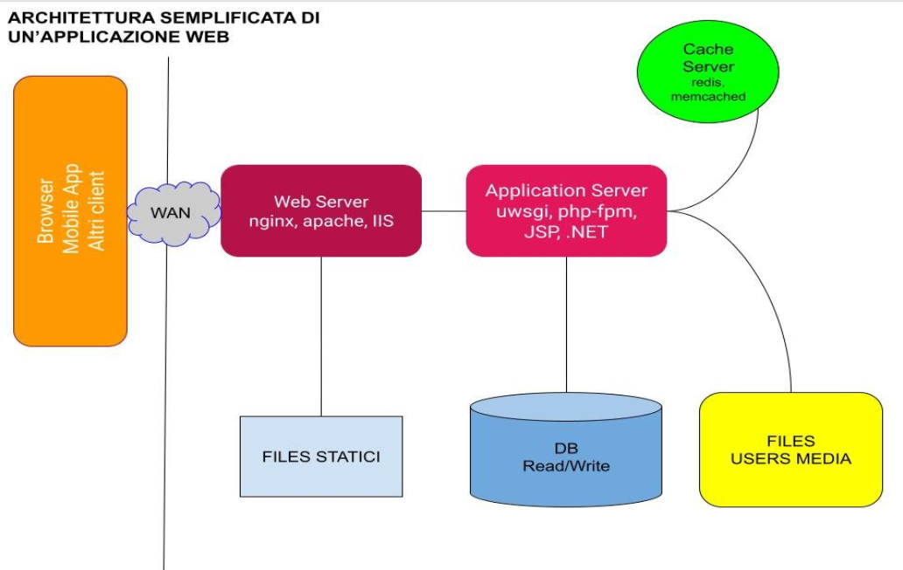

Creare una semplice applicazione cloud con Docker Compose
=========================================================

Vengono forniti file compose separati per i servizi:

  - db
  - redis
  - uwsgi

e poi messi insieme aggiungendo nginx come front web server  

## Steps

A livello didattico sono previsti vari steps:

  - prima compose-db.yml
  - poi compose-redis.yml
  - poi compose-uwsgi.yml
  - poi compose.yml

Si veda la [presentazione "un caso reale"](./pres-compose-un-caso-reale.pdf)

## SSL

Per usare il terminatore SSL usare compose-ssl.yml che differisce solo nella parte di nginx.

Si può avviare con docker-compose -f compose-ssl.yml up

I certificati generati localmente sono stati committati direttamente nel repository anche la chiave privata dato che non presentano una challenge di sicurezza, ma la copia dal sito let's encrypt del comando

openssl req -x509 -out nginx/cert.pem -keyout nginx/privkey.pem \
  -newkey rsa:2048 -nodes -sha256 \
  -subj '/CN=localhost' -extensions EXT -config <( \
   printf "[dn]\nCN=localhost\n[req]\ndistinguished_name = dn\n[EXT]\nsubjectAltName=DNS:localhost\nkeyUsage=digitalSignature\nextendedKeyUsage=serverAuth")

